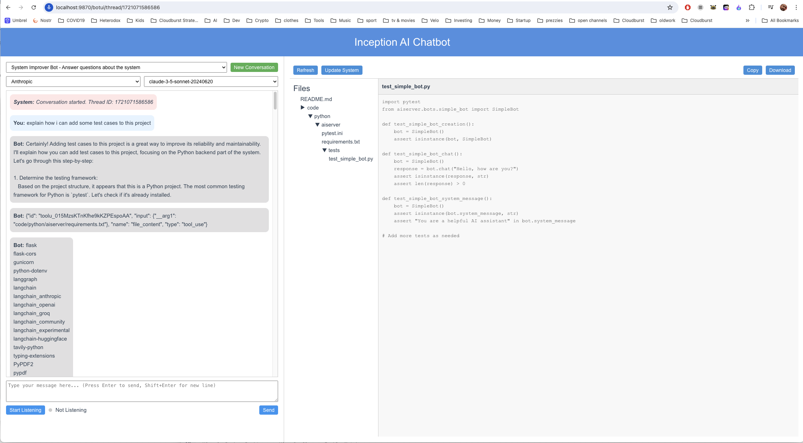

# Inception AI Chatbot Project

This is a playground project for experimenting with different AI models and chatbot configurations.
It uses Langchain and Langgraph to create a flexible and extensible chatbot system that can interact with various language models and tools.

The project consists of a web interface for interacting with a chatbot server running in a Docker container.

The UI allows you to change the following:

* Which bot you are talking to
  * You can add new bots under /code/python/py-server/bots/
  * Make sure you also add that bot to /code/python/py-server/bots/configured_bots.py
* Which LLM Provider you are using
  * Local or remote Ollama (via OLLAMA_BASE_URL in .env)
  * Anthropic Claude
  * Open AI
  * Groq
* Which LLM model you are using
  * Will query Ollama for the list of installed models

Now supports audit transcription in the Web UI! .
Click "Start Listening" and just ask the chatbot to do something :)
(Add your ASSEMBLYAI_API_KEY to the .env file to enable this feature)

## System Improver Bot

You can select the System Improver Bot from the UI to chat with this current system and suggest updates etc
You can say things like:

* _"add a new rag bot based on https://en.wikipedia.org/wiki/White_blood_cell"_
* _"add a new rag bot that uses the iso20022 retriever and is an expert in all things ISO20022"_

And it will think about it and generate some code for you which you can view by clicking on the "Files" button.
If you are happy with the code you can click on "Update Files" button to update the running system with the new code.

*Note:* you will have to set ENABLE_HOT_RELOAD=true to see the changes immediately 
(which can cause the system to crash if the code generation is not 100% correct)
and then refresh the UI to see your new bot in the list of available bots.

## UI Screenshot



# Example Bots

The project includes several specialized bots, each designed for specific tasks:

* System Improver Bot - [code/python/aiserver/bots/system_improver_bot.py](code/python/aiserver/bots/system_improver_bot.py)
  * Specialized in analyzing and suggesting improvements for software systems
  * Can review system structures, answer questions about the system, and propose enhancements
  * Has access to file content and can generate or modify code snippets
* Simple Bot - [code/python/aiserver/bots/simple_bot.py](code/python/aiserver/bots/simple_bot.py)
  * A basic Langgraph bot without any additional tools
  * Suitable for general conversations and simple queries
* Simple Retriever Bot - [code/python/aiserver/bots/simple_retriever_bot.py](code/python/aiserver/bots/simple_rag_qa_bot.py)
  * A bot that uses Retrieval-Augmented Generation (RAG) for question answering
* Web App Bot - [code/python/aiserver/bots/web_app_bot.py](code/python/aiserver/bots/web_app_bot.py)
  * Focused on creating single HTML file web applications
  * Can generate complete, self-contained HTML files with embedded CSS and JavaScript
  * Implements modern web development practices and responsive design
* Web Search Bot - [code/python/aiserver/bots/web_search_bot.py](code/python/aiserver/bots/web_search_bot.py)
  * A Langgraph bot equipped with a web search tool
  * Capable of providing information from the internet to answer queries
* Ollama Bot - [code/python/aiserver/bots/ollama_bot.py](code/python/aiserver/bots/ollama_bot.py)
  * A bot that interacts directly with Ollama models
  * Does not use the Langchain framework, providing a different approach to bot interactions

Each bot is designed to showcase different capabilities and use cases within the Inception AI Chatbot Project.

## Prerequisites

- Docker and Docker Compose
- Git

## Setup

1. Clone the repository:
   ```
   git clone <repository-url>
   cd <repository-name>
   ```

2. Create a `.env` file in the root directory based on `.example.env`:
   ```
   cp .example.env .env
   ```

3. Edit the `.env` file and add your API keys:
   ```
   ANTHROPIC_API_KEY=your_anthropic_api_key_here
   OPENAI_API_KEY=your_openai_api_key_here
   LANGSMITH_API_KEY=your_langsmith_api_key_here
   TAVILY_API_KEY=your_tavily_api_key_here
   ```

## Retriever Configuration

The project now includes a retriever functionality that allows bots to access and search through vector databases. This feature is configured using environment variables in the `.env` file. Here are the key configuration options:

1. Retriever Collections:
   A comma-separated list of named retrievers each corresponding to a folder under '/data/imported' that contains the source docs
   We currently support .pdf, .txt and .xml files (although the latter 2 have not been tested yet)
   ```
   RETRIEVER_COLLECTIONS=uktax
   ```
   This variable specifies the collections that the retriever can access. Each collection corresponds to a specific set of embeddings that can be queried by the bots.

2. Embedding Provider:
   Set the default embedding provider using the `DEFAULT_EMBEDDING_PROVIDER` variable.
   ```
   DEFAULT_EMBEDDING_PROVIDER=openai
   ```
   Supported options are:
   - `openai`: Uses OpenAI's embedding model
   - `huggingface`: Uses HuggingFace's embedding models

3. Embedding Model:
   Set the default embedding model using the `DEFAULT_EMBEDDING_MODEL` variable.
   ```
   DEFAULT_EMBEDDING_MODEL=text-embedding-ada-002
   ```
   The default model for OpenAI is "text-embedding-ada-002". For HuggingFace, you can specify any compatible model name.

4. Persist Directory:
   The embeddings are stored in a ChromaDB database. The default persist directory is set to:
   ```
   /data/embeddings/__chromadb
   ```
   This directory is used to store the vector database files.

See the simple_retriever_bot.py for an example of how to use the retriever functionality.

## Building and Running

1. In the root directory of the project, you'll find two scripts: `up.sh` and `buildAndUp.sh`. These scripts simplify the process of starting your Docker containers.

2. To start the containers without rebuilding:
   ```
   ./up.sh
   ```
   This command will run `docker compose up` from the `docker` directory.

3. To rebuild and start the containers:
   ```
   ./buildAndUp.sh
   ```
   This command will run `docker compose up --build` from the `docker` directory which will rebuild the containers if needed before running them.

4. You can also pass environment variables to these scripts:
   ```
   ./up.sh SYSTEM_SOURCE_PATH=/path/to/source
   ```
   or
   ```
   ./buildAndUp.sh ENABLE_HOT_RELOAD=true
   ```
    *ENABLE_HOT_RELOAD=true will cause the aiserver to reload when it detects changes in the source code which can cause the system to crash.*
5. The UI will be accessible at [http://localhost:9870](http://localhost:9870)

6. To stop the containers, use Ctrl+C in the terminal where the containers are running, or run:
   ```
   ./down.sh
   ```

## Building and Deploying the BotUI

To create a production build of the BotUI and deploy it to the web folder:

1. Navigate to the BotUI directory:
   ```
   cd code/vue/botui
   ```

2. Run the build and deploy script:
   ```
   ./build_and_deploy_botui.sh
   ```

This script will build the BotUI, create a production-ready version, and copy the files to the `code/web/www/botui/` directory, which will be served by Nginx.

After running this script, the updated BotUI will be available at `http://localhost:9870/botui/`.

## Using the Chatbot

Open [http://localhost:9870](http://localhost:9870) in a web browser to access the production version of the BotUI.

### BotUI Development

For development purposes, you can still run the botui in dev mode:

    npm run dev 

And then use [http://localhost:5173](http://localhost:5173) to access the development version of the BotUI.

## Development

- The main server code is located in `code/python/py-server/server.py`.
- To modify the Python dependencies, update `code/python/py-server/requirements.txt`.
- The Gunicorn configuration is in `code/python/py-server/gunicorn.conf.py`.
- To modify the Docker setup, edit `docker/Dockerfile.python-server` and `docker/docker-compose.yml`.

### Auto-reloading during development

The server is configured to auto-reload when code changes are detected. This means that most changes you make to the Python files will be reflected immediately without needing to rebuild or restart the Docker container.

To take advantage of this:

1. Make sure your Docker container is running (`docker-compose up`).
2. Edit the Python files in the `code/python/py-server` directory.
3. Save your changes.
4. The server should automatically detect the changes and restart.

Note: While code changes will trigger a reload, any in-memory data or state will be lost during this process. This includes any ongoing conversations or temporary data not stored in a persistent database.

For changes to requirements or Docker configuration, you will still need to rebuild and restart the container:

```
docker-compose down
docker-compose up --build
```

## Troubleshooting

- If you encounter any issues with API keys, ensure they are correctly set in the `.env` file.
- For CORS issues, check that the server is properly configured to accept requests from the client's origin.
- Check Docker logs for any error messages:
  ```
  docker-compose logs python-server
  ```

- If you encounter issues with the retriever functionality:
  - Ensure that the `DEFAULT_EMBEDDING_PROVIDER` and `DEFAULT_EMBEDDING_MODEL` are correctly set in your `.env` file.
  - Check that the necessary API keys (e.g., OPENAI_API_KEY) are properly configured if using the OpenAI embedding provider.
  - Verify that the persist directory for ChromaDB (/data/embeddings/__chromadb) exists and has the correct permissions within the Docker container.

# External System Improver Bot

You can chat with an external system instead of this system by starting docker with:

    ./up.sh SYSTEM_SOURCE_PATH=/path/to/external/system

## Hints File

You can add a file called *hints.md* to the root of your system to provide hints to the 
System Improver Bot on how to improve your system for example:

    # General

    You could be asked to improve any part of the system and you should do your best to do that.
    Below are some hints that might be helpful if you asked for a specific thing to do

    ## Widgets
    
    When asked to create a new widget you should fetch an example that makes sense and use it as a template.
    Here are some ideas for good examples to use:
    * /src/widgetsystem/widgets/simple_widget.py - default widget
    * /src/widgetsystem/widgets/complex_widget.py - more complex widget that does x y z

## License and Copyright

This project is licensed under the Creative Commons Attribution-NonCommercial 4.0 International License (CC BY-NC 4.0). For the full license text, please see the `LICENSE.txt` file in the root directory of this project or visit [http://creativecommons.org/licenses/by-nc/4.0/](http://creativecommons.org/licenses/by-nc/4.0/).

Copyright © 2024 Adam Chesney

For commercial use inquiries, please contact:
Adam Chesney
Email: ajchesney@gmail.com
